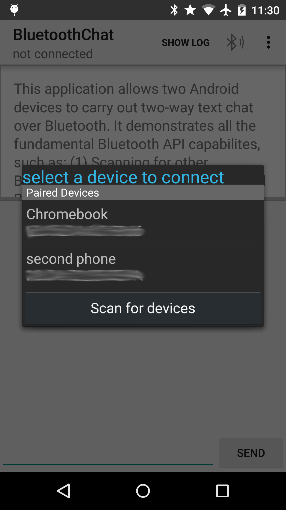

MaxiMMI
===================================

Title: Multimodal Task-Oriented Operating Systems for Flexible and User-Centered Human-Machine Interaction on Production Machines (Multimodale, aufgabenorientierte Bediensysteme zur flexiblen und nutzerzentrierten Mensch-Maschine-Interaktion an Produktionsmaschinen)

Abstract: The MaxiMMI lab software includes a tablet-app, a smartwatch program, and a data glasses program to facilitate human-machine interaction. This study aims to investigate the effectiveness of these devices in remote monitoring and work progress, specifically in terms of reaction time, error rate, and user satisfaction.

I. Introduction
A. Background
1. Multimodal, task-oriented operating systems
2. MaxiMMI lab software: tablet-app, smartwatch, data glasses
B. Research Questions
1. Impact of devices on reaction time, error rate, and user satisfaction
2. Best device for user alerts

II. Lab Design and Experimental Procedure
A. Simple assembly task: carburetor, engine, cylinder block
B. Experimental Parts
1. Part 1: Remote monitoring
2. Part 2: Work progress
C. Trial runs
D. Scenario: Alarms on mobile devices

III. Methodology
A. Independent Variables
1. Modality: visual, visual+tactile
2. Output device: data glasses, smartwatch, monitor
B. Conditions
1. Monitor: visual
2. Monitor + data glasses: visual
3. Monitor + smartwatch: visual+tactile
C. Dependent Variables
1. Number of unnoticed messages
2. Error rate
3. Reaction time
4. Objective workload, perceived effort
D. Data Collection
1. Reaction time, error rate, unnoticed messages
2. Post-test questionnaires
3. Heart rate, blood pressure, EOG
4. Number of screws, assembly time, alarm time

IV. Hypotheses for Remote Monitoring and Work Progress
A. Remote Monitoring Hypotheses (H1-H6)
B. Work Progress Hypotheses (H1-H5)

V. Program for the HMI
A. Prerequisites
B. Properties of the Program
C. Data Output

VI. Research Scenarios
A. Remote Monitoring Scenario
B. Work Progress Scenario

VII. Results and Analysis
A. Independent Variables Impact on Dependent Variables
B. User Satisfaction and Usability

VIII. Conclusion
A. Summary of Findings
B. Implications and Future Research

IX. Acknowledgements

X. References
Multimodal, Task-Oriented Operating Systems for Flexible and User-Centered Human-Machine Interaction in Production Machines: Subproject: FlexHMI - Target Group-Oriented Development and Evaluation of Multimodal HMI Concepts in Production Facilities 
[Final Report](https://www.tib.eu/en/suchen/id/TIBKAT:1023341441/) 
[MaxiMMI](https://www.interaktive-technologien.de/projekte/maximmi)

Android BluetoothChat Sample
===================================

This sample shows how to implement two-way text chat over Bluetooth between two Android devices, using
all the fundamental Bluetooth API capabilities.

Introduction
------------

This sample should be run on two Android devices at the same time, to establish a two-way chat over
Bluetooth between the devices. Select "Made discoverable" in overflow menu on one device and click
on the Bluetooth icon on the other one, to find the device and establish the connection.

The sample demonstrates the following, using the [Bluetooth API][1]:

1. [Setting up][2] Bluetooth
2. [Scanning][3] for other Bluetooth devices
3. [Querying][4] the local Bluetooth adapter for paired Bluetooth devices
4. [Establishing RFCOMM][5] channels/sockets
5. [Connecting][6] to a remote device
6. [Transfering][7] data over Bluetooth

[1]: http://developer.android.com/guide/topics/connectivity/bluetooth.html
[2]: http://developer.android.com/guide/topics/connectivity/bluetooth.html#Permissions
[3]: http://developer.android.com/guide/topics/connectivity/bluetooth.html#FindingDevices
[4]: http://developer.android.com/guide/topics/connectivity/bluetooth.html#QueryingPairedDevices
[5]: http://developer.android.com/guide/topics/connectivity/bluetooth.html#ConnectingDevices
[6]: http://developer.android.com/guide/topics/connectivity/bluetooth.html#ConnectingAsAClient
[7]: http://developer.android.com/guide/topics/connectivity/bluetooth.html#ManagingAConnection

Pre-requisites
--------------

- Android SDK v23
- Android Build Tools v23.0.2
- Android Support Repository

Screenshots
-------------

   

Getting Started
---------------

This sample uses the Gradle build system. To build this project, use the
"gradlew build" command or use "Import Project" in Android Studio.

Support
-------

- Google+ Community: https://plus.google.com/communities/105153134372062985968
- Stack Overflow: http://stackoverflow.com/questions/tagged/android

If you've found an error in this sample, please file an issue:
https://github.com/googlesamples/android-BluetoothChat

Patches are encouraged, and may be submitted by forking this project and
submitting a pull request through GitHub. Please see CONTRIBUTING.md for more details.

License
-------

Copyright 2014 The Android Open Source Project, Inc.

Licensed to the Apache Software Foundation (ASF) under one or more contributor
license agreements.  See the NOTICE file distributed with this work for
additional information regarding copyright ownership.  The ASF licenses this
file to you under the Apache License, Version 2.0 (the "License"); you may not
use this file except in compliance with the License.  You may obtain a copy of
the License at

http://www.apache.org/licenses/LICENSE-2.0

Unless required by applicable law or agreed to in writing, software
distributed under the License is distributed on an "AS IS" BASIS, WITHOUT
WARRANTIES OR CONDITIONS OF ANY KIND, either express or implied.  See the
License for the specific language governing permissions and limitations under
the License.
"# MaxiMMI" 
